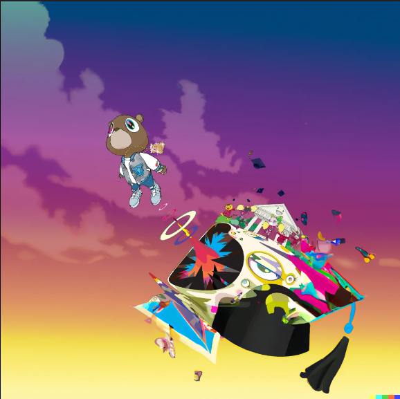

# MileStone 1

## 1. What book, album or movie did you choose? What is it about?
I chose Kanye West’s Graduation album, which came out in 2007. It’s his third studio album, and it’s known for blending different genres like hip-hop, electronic music, and stadium anthems. The album dives into themes of personal growth, success, fame, and Kanye’s journey as an artist evolving over time. The cover art, created by Japanese artist Takashi Murakami, is colorful and surreal. It features Kanye’s iconic “Dropout Bear” mascot, shown launching into the sky, which symbolizes moving forward and reaching new heights in life.

## 2. What aspect of the book will you include in your cover?
For my project, I’m going to include interactive animations of different elements from the Graduation cover art. Things like the “Dropout Bear,” flying graduation caps, and abstract visuals will all have features you can interact with. Users will be able to click on parts of the image to make them animate, like the bear floating up into the sky or other objects pulsing with movement. Along with these animations, there will be pop-ups or overlays sharing interesting facts and background info about the artwork, the creative process behind it, and how these elements tie into Kanye’s journey. The mix of animation and storytelling will make the cover both fun to engage with and informative, reflecting the themes of growth, success, and evolution in the album.

## 3. Is it interactive? time-based? both?
The cover will be both interactive and time-based. Users can click or hover over different parts of the image to trigger animations and see facts pop up about each element. There will also be subtle time-based features, like colors that shift or characters that slowly move, making the cover feel dynamic and always changing. This combination of interaction and timed animations will make the experience more engaging and reflect the themes of transformation and growth that are central to the Graduation album.

## 4. What ideas would you like to explore or experiment with?  
I want to explore how to combine interactive animations with informative content. Specifically, I’d like to experiment with adding background details about the image and the inspiration behind the Graduation album cover. As users interact with different parts of the image, animations will play while also revealing facts about how the cover was created, Kanye’s collaboration with artist Takashi Murakami, and the meaning behind the different elements. This mix of visuals, animation, and information will make the experience more immersive, letting users not only engage with the artwork but also learn about its significance.

## 5. Are there aspects of your project that are related to any of the readings we’ve done?
Yes, this project connects closely to the readings we've done on interactive design, visual storytelling, and how art engages users. The way I plan to include interactive elements and animations in the album cover reflects what we've discussed about how media can be designed to invite people to engage more deeply. Using visuals, movement, and interactivity to tell a story—while also providing background info about the Graduation album—relates to the theories we've studied on how art can be both captivating and informative, drawing people into a more immersive experience.

Also, the way Kanye West’s music blends with Takashi Murakami’s artwork ties into our readings on how popular culture and postmodern art come together to create bold, boundary-pushing designs. The idea of using animation to guide users through an experience or communicate deeper meanings is something we've learned about in terms of motion and narrative in design. By applying these ideas to this project, I'm directly pulling from the theoretical frameworks we've covered in class.

## Graduation Album Cover:  

## Graduation Album Cover:  

