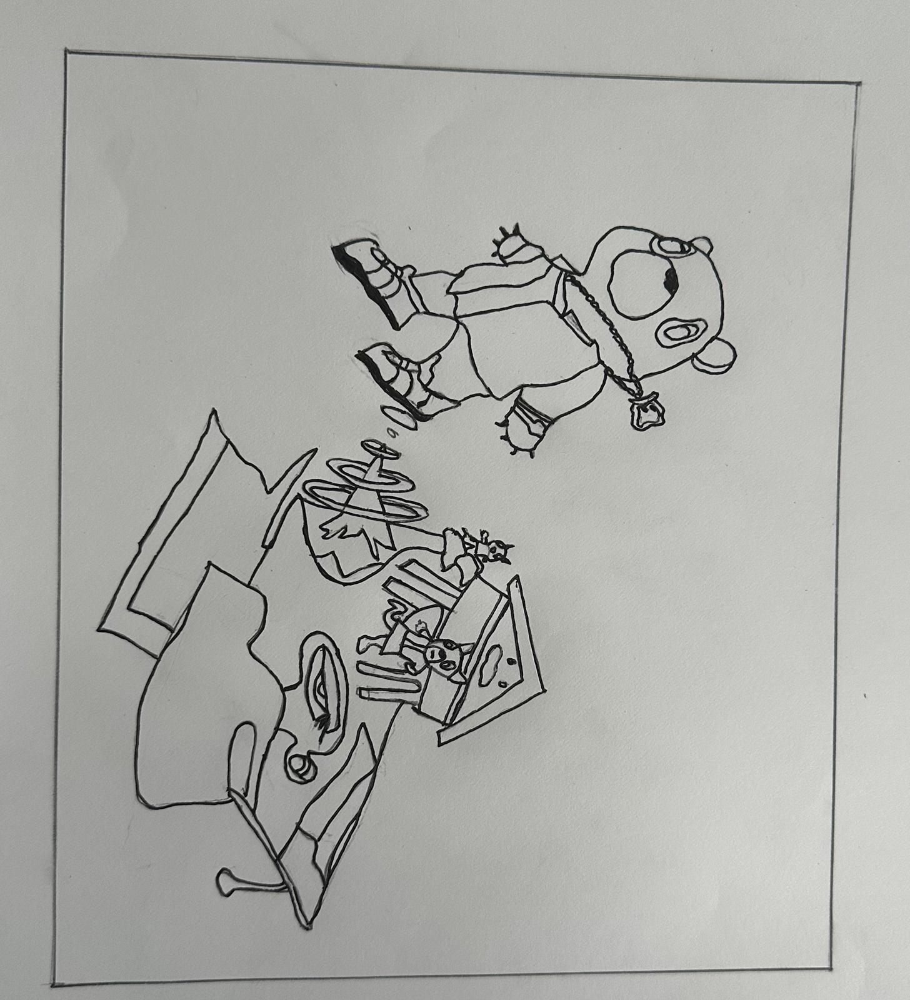

# MileStone 3
### For Milestone 3, I created a website with interactive elements and animations, implementing the features we outlined previously. The site uses a full-screen canvas, set up via the HTML file (index.html), and employs p5.js to manage animations and user interactions, creating an immersive, visually clean experience.

## Key Code Highlights
### 1. initializeCanvas() :- 
Sets up a full-screen canvas as the main display area.

### 2. coverElements Array:-
Stores interactive elements, each with properties like name, info, and animation type.

### 3. loadElements() and addElementInteractivity():-
Renders elements on the canvas and makes them interactive, adding click events that trigger animations or display information pop-ups.

### 4. Animation Functions (e.g., triggerAnimation() and addTimeBasedAnimation()):-
Apply animations like floating, spinning, or color shifting.

### 5. updateCanvas() and checkForUserInteractions():-
Continuously refresh animations and monitor user actions in real-time.

Milestone 3 successfully establishes the website’s core functionality, providing a robust foundation for future enhancements and interactivity.

# MileStone 2

## what I’ve done this week
This week, I made good progress on my interactive album cover project. I started by outlining the main elements and drafting the pseudocode to make sure I covered all the essential features, like interactivity, animations, and pop-up info. I also refined the project’s structure to meet the assignment requirements, adding custom functions, arrays, loops, and conditional statements where needed. I spent some time brainstorming how to make the experience more immersive by including background details and time-based animations that match the themes of the *Graduation* album. 

## Pseudo-code

### Initialize the main interactive canvas
initializeCanvas()

### Define elements array with objects, each containing element details and associated information
coverElements = [
    { "name": "DropoutBear", "info": "Symbol of Kanye’s journey and growth", "animation": "float" },
    { "name": "GraduationCap", "info": "Represents the theme of moving forward", "animation": "spin" },
    { "name": "Background", "info": "Abstract elements symbolizing the surreal cover art", "animation": "colorShift" }
]

### Define custom function to load and render all elements onto the canvas
function loadElements(elementsArray):
    for each element in elementsArray:
        renderElement(element)            

### Define custom function to assign interactivity and animations to each element
function addElementInteractivity(elementsArray):
    for each element in elementsArray:
        addEventListener(element, "click"):
            handleClickEvent(element)      
                 addTimeBasedAnimation(element)   

### Custom function to handle click events, displaying pop-ups and triggering animations
function handleClickEvent(element):
    if element has assigned info:
        displayInfoPopup(element)         
    if element has assigned animation:
        triggerAnimation(element)         

### Define function to display pop-up with element-specific information
function displayInfoPopup(element):
    createPopup(element.info)             
    setPopupPosition(element)       
    allowClosePopup()                    

### Define function to trigger animations based on element type
function triggerAnimation(element):
    if element.animation == "float":
        animate element floating upwards
    elif element.animation == "spin":
        animate element spinning
    elif element.animation == "colorShift":
        apply gradual color shift animation to element

### Custom function to apply time-based animations
function addTimeBasedAnimation(element):
    if element.animation == "float":
        apply subtle floating movement
    elif element.animation == "colorShift":
        apply continuous color shift

### Initialize project by loading elements and setting up interactivity
function initializeProject():
    loadElements(coverElements)            
    addElementInteractivity(coverElements) 

### Main loop to update animations and check for user interactions
while project is active:
    updateCanvas()                         
    checkForUserInteractions()            

### End project and clean up resources when user exits
function endProject():
    clearCanvas()                         
    releaseResources()                     

### Start project
initializeProject()

## Pseudo-code Explanation (description of the files, classes, objects or arrays you will use)

### 1. nitializeCanvas() :- 
Purpose: Sets up the main canvas where all visual elements will be displayed.
Function: Prepares the display area for adding interactive elements, animations, and user interactions by creating a full-screen canvas and setting the initial background.

### 2. coverElements Array:-
Purpose: Stores all interactive elements as objects, each containing properties (like name, info, and animation type) that define how each element behaves.
Function: Provides an organized structure to store each element’s details, allowing easy access to specific information and behaviors. This array will be looped through to apply animations and interactivity.

### 3.loadElements(elementsArray) :-
Purpose: Renders each element from coverElements onto the canvas.
Function: Loops through elementsArray (the coverElements array), calling renderElement(element) for each element to place it visually on the canvas.

### 4. addElementInteractivity(elementsArray) Function:-
Purpose: Adds interactivity (click events) and time-based animations to each element.
Function: Iterates over each element in elementsArray, assigning event listeners and calling functions to trigger animations and pop-ups upon user interaction.

### 5. addEventListener(element, "click")
Purpose: Listens for a user’s click on each element and triggers specific functions in response.
Function: Calls handleClickEvent(element) when an element is clicked, which handles animations and displays information pop-ups.

###6.  handleClickEvent(element) Function
Purpose: Manages the actions that occur when an element is clicked.
Function:Checks if the clicked element has assigned information (with an if statement).
If true, calls displayInfoPopup(element) to show information about the element in a pop-up.
Checks the element’s assigned animation type and, if available, triggers triggerAnimation(element) to initiate the element’s specific animation.

### 7. displayInfoPopup(element) Function
Purpose: Displays a pop-up window with information about the clicked element.
Function:
Uses createPopup(element.info) to display the info stored in element.
Positions the pop-up near the element using setPopupPosition(element) for clarity.
Allows the user to close the pop-up via allowClosePopup(), creating a cleaner interface.

### 8. createPopup(info) Function
Purpose: Generates the visual pop-up displaying the information about an element.
Function: Formats and displays the info parameter (which is the specific information about the clicked element) in a pop-up window.

### 9. setPopupPosition(element) Function
Purpose: Positions the pop-up near the clicked element for a better user experience.
Function: Calculates the position of the element on the screen and adjusts the pop-up position to be close by, ensuring it appears contextually related to the element.

### 10. allowClosePopup() Function
Purpose: Enables users to close the pop-up to avoid clutter.
Function: Provides a close button (like an “X”) on the pop-up that, when clicked, removes the pop-up from the canvas.

### 11. triggerAnimation(element) Function
Purpose: Activates specific animations based on the element’s animation property.
Function:
Uses if statements to check element.animation and apply the appropriate animation type:
If animation is “float,” it animates the element floating upwards.
If animation is “spin,” it spins the element.
If animation is “colorShift,” it applies a gradual color shift animation.

### 12. addTimeBasedAnimation(element) Function
Purpose: Applies ongoing animations to elements that should change over time.
Function: Uses if statements to check each element’s animation type and apply a continuous effect:
“float” triggers a subtle up-and-down floating effect.
“colorShift” applies a gentle color change over time.

### 13. initializeProject() Function
Purpose: Sets up the project by loading elements and adding interactivity.
Function: Calls loadElements() to place all elements on the canvas and addElementInteractivity() to make them interactive.

### 14. Main while Loop
Purpose: Keeps the canvas updated, managing both animations and interactions while the project is active.
Function:
Continuously calls updateCanvas() to refresh and animate elements.
Monitors user interactions, such as clicks or hovers, with checkForUserInteractions().

### 15. updateCanvas() Function
Purpose: Refreshes the canvas to keep animations and visual updates active.
Function: Updates all ongoing animations and responds to user interactions in real-time.

### 16. checkForUserInteractions() Function
Purpose: Monitors for user interactions like clicks or hovers.
Function: Detects when users interact with elements, triggering the appropriate functions (like displaying a pop-up or animation).

### 17. endProject() Function
Purpose: Cleans up resources and resets states when the project is closed.
Function: Calls clearCanvas() to remove elements from the display and releaseResources() to free up any allocated memory or files.

### 18. clearCanvas() and releaseResources() Functions
Purpose: Perform cleanup when the project ends.
Function:
clearCanvas() removes all elements and animations from the screen.
releaseResources() frees up memory or other resources to ensure efficient performance.

### 19. initializeProject() Function Call
Purpose: Starts the project by loading elements and setting up interactivity.
Function: The main entry point for running the project, calling functions to initialize the canvas, load elements, and prepare interactions.

# MileStone 1

## 1. What book, album or movie did you choose? What is it about?
I chose Kanye West’s Graduation album, which came out in 2007. It’s his third studio album, and it’s known for blending different genres like hip-hop, electronic music, and stadium anthems. The album dives into themes of personal growth, success, fame, and Kanye’s journey as an artist evolving over time. The cover art, created by Japanese artist Takashi Murakami, is colorful and surreal. It features Kanye’s iconic “Dropout Bear” mascot, shown launching into the sky, which symbolizes moving forward and reaching new heights in life.

## 2. What aspect of the book will you include in your cover?
For my project, I’m going to include interactive animations of different elements from the Graduation cover art. Things like the “Dropout Bear,” flying graduation caps, and abstract visuals will all have features you can interact with. Users will be able to click on parts of the image to make them animate, like the bear floating up into the sky or other objects pulsing with movement. Along with these animations, there will be pop-ups or overlays sharing interesting facts and background info about the artwork, the creative process behind it, and how these elements tie into Kanye’s journey. The mix of animation and storytelling will make the cover both fun to engage with and informative, reflecting the themes of growth, success, and evolution in the album.

## 3. Is it interactive? time-based? both?
The cover will be both interactive and time-based. Users can click or hover over different parts of the image to trigger animations and see facts pop up about each element. There will also be subtle time-based features, like colors that shift or characters that slowly move, making the cover feel dynamic and always changing. This combination of interaction and timed animations will make the experience more engaging and reflect the themes of transformation and growth that are central to the Graduation album.

## 4. What ideas would you like to explore or experiment with?  
I want to explore how to combine interactive animations with informative content. Specifically, I’d like to experiment with adding background details about the image and the inspiration behind the Graduation album cover. As users interact with different parts of the image, animations will play while also revealing facts about how the cover was created, Kanye’s collaboration with artist Takashi Murakami, and the meaning behind the different elements. This mix of visuals, animation, and information will make the experience more immersive, letting users not only engage with the artwork but also learn about its significance.

## 5. Are there aspects of your project that are related to any of the readings we’ve done?
Yes, this project connects closely to the readings we've done on interactive design, visual storytelling, and how art engages users. The way I plan to include interactive elements and animations in the album cover reflects what we've discussed about how media can be designed to invite people to engage more deeply. Using visuals, movement, and interactivity to tell a story—while also providing background info about the Graduation album—relates to the theories we've studied on how art can be both captivating and informative, drawing people into a more immersive experience.

Also, the way Kanye West’s music blends with Takashi Murakami’s artwork ties into our readings on how popular culture and postmodern art come together to create bold, boundary-pushing designs. The idea of using animation to guide users through an experience or communicate deeper meanings is something we've learned about in terms of motion and narrative in design. By applying these ideas to this project, I'm directly pulling from the theoretical frameworks we've covered in class.

## Graduation Album Cover:  

## Graduation Album Sketch:  

